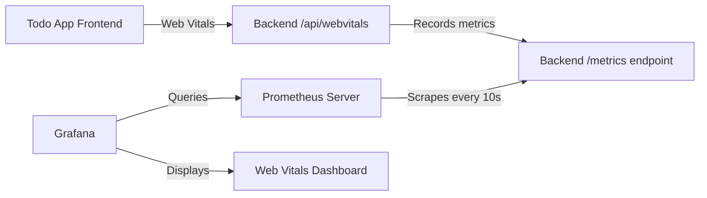

# Web Vitals Monitoring with Prometheus + Grafana

This setup provides a complete monitoring stack for Web Vitals metrics from your Todo App.

## 🚀 Quick Start

### Option 1: Automated Setup (Recommended)
```bash
# Run the setup script
./setup-monitoring.sh
```

### Option 2: Manual Setup
```bash
# 1. Build the backend
cd backend && npm run build && cd ..

# 2. Start monitoring stack
docker-compose up -d

# 3. Start the Todo App backend
cd backend && npm start
```

## 📊 Services

| Service | URL | Credentials |
|---------|-----|-------------|
| **Grafana** | http://localhost:3001 | admin / admin |
| **Prometheus** | http://localhost:9090 | - |
| **Todo App Frontend** | http://localhost:3000 | - |
| **Todo App Backend** | http://localhost:4000 | - |

## 🎯 How It Works



1. **Frontend** collects Web Vitals (FCP, LCP, CLS, FID, INP, TTFB)
2. **Backend** receives metrics at `/api/webvitals` and records them for Prometheus
3. **Prometheus** scrapes metrics from backend `/metrics` endpoint every 10 seconds
4. **Grafana** queries Prometheus and displays real-time Web Vitals dashboard

## 📈 Available Metrics

### Core Web Vitals
- **FCP** (First Contentful Paint) - Loading performance
- **LCP** (Largest Contentful Paint) - Loading performance  
- **CLS** (Cumulative Layout Shift) - Visual stability
- **FID** (First Input Delay) - Interactivity
- **INP** (Interaction to Next Paint) - Responsiveness
- **TTFB** (Time to First Byte) - Server response time

### Metric Types
- **Histograms**: Distribution analysis with configurable buckets
- **Gauges**: Current values for real-time monitoring
- **Counters**: Total measurements and performance categorization (good/needs-improvement/poor)

## 🔧 Configuration

### Prometheus Configuration
- **File**: `prometheus.yml`
- **Scrape interval**: 10 seconds for Todo App backend
- **Target**: `host.docker.internal:4000/metrics` (Docker) or `localhost:4000/metrics` (native)

### Grafana Configuration
- **Data source**: Auto-configured Prometheus connection
- **Dashboard**: Pre-built Web Vitals dashboard with all Core Web Vitals
- **Provisioning**: Automatic setup via configuration files in `grafana/provisioning/`

## 🛠 Troubleshooting

### Check Service Status
```bash
# View all containers
docker-compose ps

# View logs
docker-compose logs prometheus
docker-compose logs grafana

# Check if backend is exposing metrics
curl http://localhost:4000/metrics | grep web_vitals
```

### Verify Prometheus Targets
1. Open http://localhost:9090
2. Go to **Status** → **Targets**
3. Ensure `todo-app-backend` target shows as **UP**

### Generate Test Data
```bash
# Send test Web Vitals metrics
curl -X POST http://localhost:4000/api/webvitals \
  -H "Content-Type: application/json" \
  -d '{"name": "FCP", "value": 1200, "id": "test-123"}'
```

### Reset Everything
```bash
# Stop and remove containers + volumes
docker-compose down -v

# Restart
docker-compose up -d
```

## 🎨 Custom Dashboards

The pre-configured dashboard includes:
- **Loading Performance**: FCP & LCP trends
- **Visual Stability**: CLS measurements
- **Interactivity**: FID & INP metrics  
- **Performance Summary**: Good/Needs Improvement/Poor score breakdown

You can create additional dashboards by:
1. Opening Grafana at http://localhost:3001
2. Using the **+** menu → **Dashboard**
3. Adding panels with Prometheus queries like:
   - `web_vitals_fcp_current` - Current FCP values
   - `rate(web_vitals_measurements_total[5m])` - Measurement rate
   - `histogram_quantile(0.95, web_vitals_fcp_seconds_bucket)` - 95th percentile FCP

## 📁 File Structure

```
├── prometheus.yml                     # Prometheus configuration
├── docker-compose.yml               # Container orchestration
├── setup-monitoring.sh              # Automated setup script
└── grafana/
    └── provisioning/
        ├── datasources/
        │   └── prometheus.yml        # Auto-configure Prometheus data source
        └── dashboards/
            ├── dashboard-provider.yml # Dashboard provider config
            └── dashboards/
                └── web-vitals.json   # Pre-built Web Vitals dashboard
```